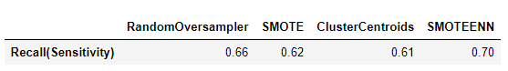

# Credit_Risk_Analysis

## Overview
There six machines learning models are built in the project to predict credit risk. Credit risk is an inherently unbalanced classification problem, as good loans easily outnumber risky loans. Therefore, we will use imbalanced-learn and scikit-learn libraries to train and evaluate models with unbalanced classes. Using the credit card credit dataset from LendingClub, a peer-to-peer lending services company, here are we will apply below:

1. RandomOverSampler (oversampling)
2. SMOTE (oversampling)
3. ClusterCentroids (undersampling)
4. SMOTEENN (over- and undersampling)
5. BalancedRandomForestClassifier (ensemble learning)
6. EasyEnsembleClassifier (ensemble learning)

## Results

**1. RandomOverSampler (oversampling)**

* Balanced accuracy scores is 66%
* Precision and sensitivity (recall) score of predicting high risk is 1% and 66%.
* Precision and sensitivity (recall) score of predicting LOW risk is 100% and 67%.

**2. SMOTE (oversampling)**

* Balanced accuracy scores is 63%
* Precision and sensitivity (recall) score of predicting high risk is 1% and 62%.
* Precision and sensitivity (recall) score of predicting LOW risk is 100% and 64%.

**3. ClusterCentroids (undersampling)**

* Balanced accuracy scores is 53%
* Precision and sensitivity (recall) score of predicting high risk is 1% and 61%.
* Precision and sensitivity (recall) score of predicting LOW risk is 100% and 45%.

**4. SMOTEENN (over- and undersamplin)**

* Balanced accuracy scores is 62%
* Precision and sensitivity (recall) score of predicting high risk is 1% and 70%.
* Precision and sensitivity (recall) score of predicting LOW risk is 100% and 54%.

**5. BalancedRandomForestClassifier (ensemble learning)**

* Balanced accuracy scores is 79%
* Precision and sensitivity (recall) score of predicting high risk is 4% and 67%.
* Precision and sensitivity (recall) score of predicting LOW risk is 100% and 91%.

**6. EasyEnsembleClassifier (ensemble learning)**

* Balanced accuracy scores is 93%
* Precision and sensitivity (recall) score of predicting high risk is 7% and 91%.
* Precision and sensitivity (recall) score of predicting LOW risk is 100% and 94%.

## Summary
1. Accurancy:

   Model of Easy Ensemble AdaBoost Classifier provides the highest accurancy,93%, among six models.

2. Precision score

   Model of Easy Ensemble AdaBoost Classifier provides the highest precision, 7%, among six models.    

   

3. Recall(Sensitivity) score

   Model of Easy Ensemble AdaBoost Classifier provides the highest precision, 91%, among six models.

4. Recommend

   In my option, I do not think that there is a model justify the risk and credit evaluation. The data given is much more low risk than high risk data. In order to better train the model, we applied six different machines learning models to either resampling or ensembling the train data. As the result, all six models are good at predicting low risk which 100 score on precision, which is a sign that the six models might be overfitting on low risk. 

   In real world, the models might lead us to make mistakes. It will just make us lose opportunity to make profits if we turn down to clients who are predicted as high risk but actually low risk. However, we will lose money if we loan to clients who are predicted as low risk but actually high risk. 

   Anyway, if we must have to choose a model to apply prediction for loan, I will pick EasyEnsembleClassifier model, since its recall (Sensitivity score) is the highest ,91%, among six models. That means the model is the most correctly recognize people who are high risk.

   